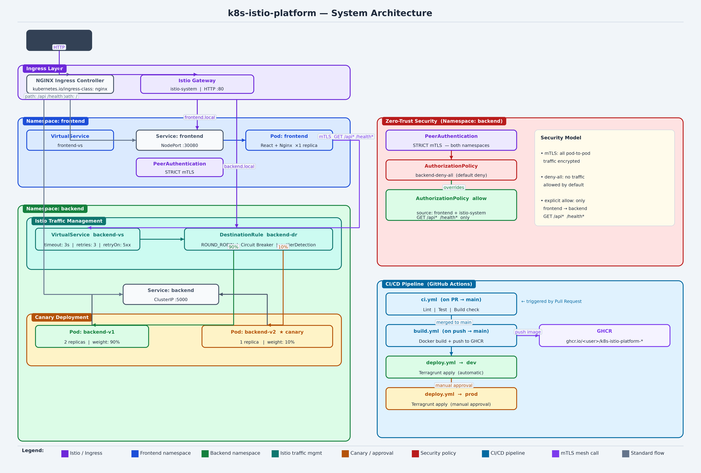

# DevOps Portfolio — k8s-istio-platform

A full-stack microservices application built to demonstrate production-grade DevOps practices: containerisation, Kubernetes orchestration, Istio service mesh, and a CI/CD pipeline with GitHub Actions.

---

## Tech Stack

| Layer | Technology |
|---|---|
| Frontend | React + Vite, served via Nginx |
| Backend | Node.js + Express (v1 & v2) |
| Containerisation | Docker, Docker Compose |
| Orchestration | Kubernetes (Minikube) |
| Service Mesh | Istio 1.21 |
| CI/CD | GitHub Actions + GHCR |
| IaC | Terraform + Terragrunt |

---

## Architecture



### Key Features Demonstrated

- **Canary deployment** — 90/10 traffic split between mesh-api v1 and v2 via Istio VirtualService + DestinationRule
- **mTLS** — STRICT PeerAuthentication enforced across `backend` and `frontend` namespaces
- **Authorisation policy** — deny-all default; only the `frontend` namespace can call backend on `GET /api*` and `/health*`
- **Resilience** — circuit breaker (outlier detection), retries, and a 3s timeout on the VirtualService
- **Fault injection** — dedicated manifest to simulate 50% latency + 20% HTTP 500s for resilience testing
- **Health probes** — liveness and readiness probes on all deployments
- **Resource limits** — CPU and memory requests/limits on every container
- **CI/CD pipeline** — lint → test → build → push to GHCR → deploy to dev (auto) → prod (manual approval)

---

## Project Structure

```
k8s-istio-platform/
├── backend/                  # Express.js API (v1 + v2)
├── frontend/                 # React + Vite SPA
├── k8s/
│   ├── namespace.yaml
│   ├── ingress.yaml
│   ├── backend/              # Deployment (v1 & v2), Service
│   ├── frontend/             # Deployment, Service
│   └── istio/                # Gateway, VirtualServices, DestinationRule,
│                             # AuthorizationPolicy, PeerAuthentication, FaultInjection
├── .github/
│   └── workflows/            # ci.yml, build.yml, deploy.yml
├── deploy.sh                 # Local Minikube deploy script
└── docker-compose.yml        # Local development
```

---

## API Endpoints

| Method | Path | Description |
|---|---|---|
| GET | /health | Health check — uptime, env, timestamp, version |
| GET | /api/info | App metadata — name, version, description |
| GET | /api/slow | Slow endpoint (5s) — used to demonstrate Istio timeout |

---

## Run Locally

**Docker Compose (recommended)**
```bash
docker compose up --build
```
Frontend: http://localhost:3000  
Backend: http://localhost:5000

**Without Docker**
```bash
# Backend
cd backend && npm install && npm run dev

# Frontend
cd frontend && npm install && npm run dev
```

---

## Deploy to Minikube

**Prerequisites**
```bash
minikube start
minikube addons enable ingress
istioctl install --set profile=demo -y
kubectl label namespace backend istio-injection=enabled
kubectl label namespace frontend istio-injection=enabled
```

**Deploy**
```bash
./deploy.sh
```

Add to `/etc/hosts`:
```
<minikube-ip>  k8s-istio-platform.backend.local
<minikube-ip>  k8s-istio-platform.frontend.local
```

| URL | Description |
|---|---|
| http://k8s-istio-platform.frontend.local | Frontend UI |
| http://k8s-istio-platform.backend.local/api/info | Backend API |
| http://k8s-istio-platform.backend.local/health | Health check |

**Useful commands**
```bash
kubectl get all -n backend
kubectl get all -n frontend
kubectl logs -l app=mesh-api -n backend
istioctl proxy-status
```

---

## Istio — Resilience Testing

Apply fault injection to simulate failures:
```bash
kubectl apply -f k8s/istio/fault-injection.yaml
```

Revert to normal routing:
```bash
kubectl apply -f k8s/istio/virtualservice-backend.yaml
```
